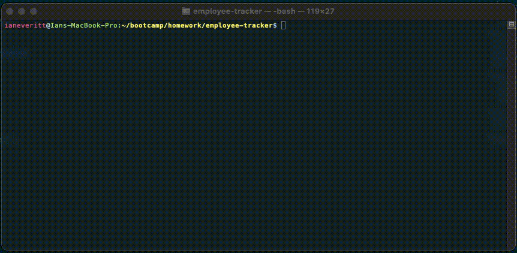

# Employee Tracker

## Description
Employee Tracker is an app used in the command line, and it allows users to keep track of information regarding their teams. In this version of the app, users are able to add/view existing employees, employee roles, and departments. Additionally, users are able to update the roles of existing employees. 

## Demo


## Installation
Before you can use the Employee Tracker, you will need to download the necessary npm packages. To do so, change directories in the command line interface to the 'employee-tracker' folder. Then type ```npm install```. You should now have all of the required npm packages installed to be able to use this app. See the next section for usage instructions.

## Usage
Before you're able to run this app, you will have to enter your MySQL ```user``` and ```password``` information in the "index.js" file. You will also need to create the database and required tables. You can do this by entering the contents of the file "schema.sql" into MySQL Workbench (though feel free to leave out the dummy values I have provided).

You are now in a position to run the app. Simply type ```node index.js``` into the command line to start the app.

## Questions
Have questions? Email me at: [ian.andrew.everitt@gmail.com](mailto:ian.andrew.everitt@gmail.com).

You can also visit my GitHub profile: [Link to Ian Everitt's GitHub profile](https://github.com/rflctvEQ)

## License
[](https://unlicense.org/)

[Unlicense link](https://unlicense.org/)

This is free and unencumbered software released into the public domain.

Anyone is free to copy, modify, publish, use, compile, sell, or
distribute this software, either in source code form or as a compiled
binary, for any purpose, commercial or non-commercial, and by any
means.

In jurisdictions that recognize copyright laws, the author or authors
of this software dedicate any and all copyright interest in the
software to the public domain. We make this dedication for the benefit
of the public at large and to the detriment of our heirs and
successors. We intend this dedication to be an overt act of
relinquishment in perpetuity of all present and future rights to this
software under copyright law.

THE SOFTWARE IS PROVIDED "AS IS", WITHOUT WARRANTY OF ANY KIND,
EXPRESS OR IMPLIED, INCLUDING BUT NOT LIMITED TO THE WARRANTIES OF
MERCHANTABILITY, FITNESS FOR A PARTICULAR PURPOSE AND NONINFRINGEMENT.
IN NO EVENT SHALL THE AUTHORS BE LIABLE FOR ANY CLAIM, DAMAGES OR
OTHER LIABILITY, WHETHER IN AN ACTION OF CONTRACT, TORT OR OTHERWISE,
ARISING FROM, OUT OF OR IN CONNECTION WITH THE SOFTWARE OR THE USE OR
OTHER DEALINGS IN THE SOFTWARE.

For more information, please refer to <http://unlicense.org/>